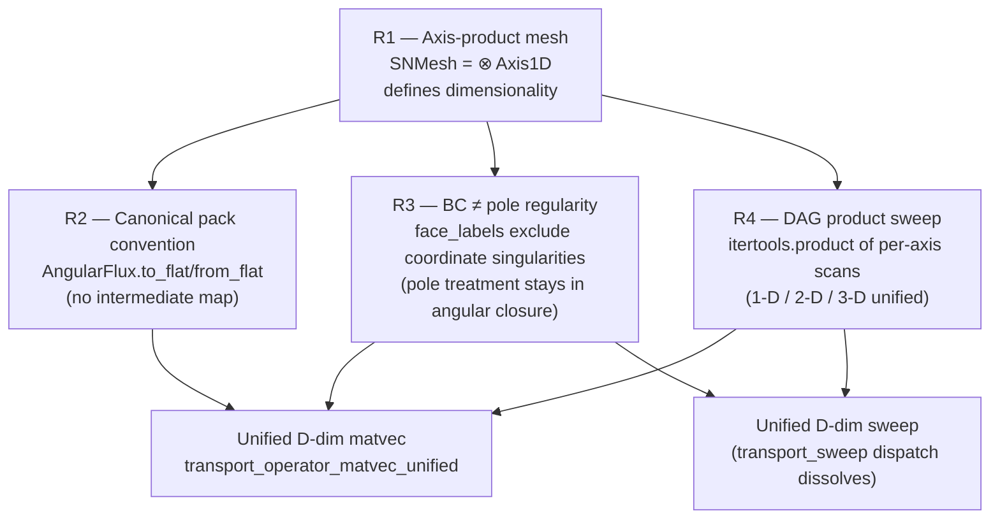

# R-1 Phase A — Dimension-agnostic typed SN architecture (Ultraplan v2)

> ## ⚡ Session resumption note (added 2026-05-26)
>
> **The active work is on a worktree, not on the original branch.**
>
> ### Where the code lives
>
> * **Worktree path**: `.claude/worktrees/r1-phase-a-dim-agnostic/`
>   (under the project root `/Users/rodrigo/git/nuclear/ORPHEUS/`).
> * **Worktree branch**: `worktree-r1-phase-a-dim-agnostic`.
> * **Branched from**: `refactor/sn-operator-algebra` at commit
>   `5e3c9b0` (which carries the R-1 Step 4 prep work — typed
>   `AngularFlux`, native-shape matvec, `KrylovAcceleration`
>   carve, etc.). The plan's nominal target branch
>   `refactor/sn-dim-agnostic` was never created; the work
>   landed on the worktree branch instead.
>
> **To resume from a cleared context**:
>
> ```bash
> # From the project root:
> cd /Users/rodrigo/git/nuclear/ORPHEUS/.claude/worktrees/r1-phase-a-dim-agnostic/
> # Or, equivalently, via the EnterWorktree tool:
> # EnterWorktree(path=".claude/worktrees/r1-phase-a-dim-agnostic")
> ```
>
> The repo `.venv` is at the project root; from the worktree run
> Python as `../../../.venv/bin/python`.
>
> ### Commits landed (most recent first)
>
> | SHA      | What                                                    |
> |----------|---------------------------------------------------------|
> | `14f45f2`| **detour-C Stages B+C** — 600 consumer callsites migrated to `Quadrature.gauss_legendre`/`.lebedev`/`.level_symmetric`/`.product`; `orpheus/sn/quadrature.py` deleted; `cylindrical_streaming` guard tightened (Pattern 4 fix); net −533 LoC. |
> | `ff37d4a`| **detour-C Stage A** — `Quadrature` canonical class at `orpheus/numerics/quadrature/directional.py`; one class with 4 classmethod factories; legacy `mu_x`/`mu_y`/`mu_z`/`weights`/`N` as `@property` views over `measure`; 22 foundation pins. |
> | `d53d94c`| **C1 fixup** — `axis._quadrature_axis_cosines` reads `measure.nodes` directly (drops the if/elif on axis-index → mu_x/mu_y/mu_z dispatch and the getattr fallback). |
> | `bf6d8a3`| **C1** — `Axis1D` primitive (`AxisMesh`, `RadialAxisMesh`, `FaceLabel`, `AxisCoord`), pure shape functions on axis tuples (`spatial_shape`, `face_labels`, `face_shape`, `face_outflow_ordinates`, `n_unknowns_flat`), `SNMesh.axes` wired via `axes_from_legacy_mesh`, `SNMesh.from_axes` classmethod, 23 foundation pins (F0.1–F0.8). |
>
> ### Verification status (as of 14f45f2)
>
> * **Collection** (cheapest catch-all): 4226 tests, **0 import errors**.
> * **Carve-baseline (sn fast subset + numerics)**: 487/487 green.
> * **`tests/numerics/`**: 495/495 green.
> * **`tests/geometry/`**: 277/277 green.
> * **`tests/sn/spatial/`** (excl. the slow streaming-equilibrium curvilinear): **304 passed, 5 failed** — all 5 are
>   **pre-existing Issue #196** (cylinder twin-path divergence on
>   `test_cylinder_three_way_standoff` ×4; SI/Krylov sphere keff
>   on `test_solve_sn_si_vs_krylov_consistency_homogeneous_sphere`).
>   **Verified to pre-exist on this branch BEFORE C1** via
>   `git stash`. **Do not chase these in C2–C5; they resolve in
>   C6** when the unified matvec lands.
> * **Sphinx**: clean build (exit 0); pre-existing `/skills/*`
>   warnings unrelated to this work.
>
> ### Memory caveat (Issue #198 / what bit the user)
>
> The full `tests/sn/` suite still grows toward ~50 GB of RSS
> mid-run (Issue #198). The verification chunks above were each
> bounded under 200 MB by running per-directory. **Do not run
> the full `pytest tests/sn/` in one invocation.** Chunk by
> subdirectory (`tests/sn/spatial/`, `tests/sn/regression/`,
> `tests/sn/l1_analytical/`, etc.) with `-p no:cacheprovider`.
>
> ### Plan-deviation log
>
> The original plan called for a fresh `refactor/sn-dim-agnostic`
> branch off `master`. The actual work landed on the worktree
> branch (forked from `refactor/sn-operator-algebra` instead),
> per the user's choice early in the session to keep the R-1
> Step 4 prep commits in the chain.
>
> The original plan's **C2 (mu_z on `AngularQuadrature` Protocol)**
> was **superseded by the detour-C carve**: the four per-family
> adapter classes (`GaussLegendre1D` / `LebedevSphere` /
> `LevelSymmetricSN` / `ProductQuadrature`) and the
> `AngularQuadrature` Protocol all retired together; the
> canonical `Quadrature` class now exposes `mu_x`/`mu_y`/`mu_z`
> as `@property` views, so the "add `mu_z` to the Protocol" task
> dissolved structurally.
>
> A small follow-up cleanup landed alongside the detour: `eta` /
> `xi` aliases on `Quadrature` for the cylindrical-SN frame
> (where the legacy `mu_x` label is misleading — column 0 is the
> **radial** cosine η, not a Cartesian X-projection). See the
> commit on top of `14f45f2`.
>
> ### What's next — C3 onward
>
> Resume at **C3 — `AngularFlux.to_flat` / `from_flat` canonical pack**
> (§6 of this plan). The Pattern 7 / Pattern 2 confusion vectors
> that bit the C1 first draft (denormalized `mu_x`/`mu_y`/`mu_z`
> beside the canonical `measure.nodes`) are now structurally
> closed; C3 can proceed without re-encountering them.
>
> Subsequent commits should continue the C-series:
> **C3 → C4 → C5 → C6 → C7 → C8**, per §6 of this plan. The pin
> ladder for each commit is locked in §7.
>
> ---

**Branch**: `refactor/sn-dim-agnostic` (fresh from `master`).
**Container base**: `ceefd60 seed` (this fresh container has no
prior `refactor/sn-operator-algebra` branch state).
**Status**: ULTRAPLAN v2 — refined per user feedback on the
foundational treatment of the pole, the canonical pack convention,
and the strict use of "tensor". Supersedes
`.claude/plans/r1_phase_a_layer_a_2d_traces.md` and the v1 draft
that mistakenly introduced `BlockLayout` (an unnecessary
intermediate that just replaces one mapping with another).

**Grand report alignment**: this plan has been cross-checked against
`.claude/plans/neutron_transport_grand_report_v3.md` (uploaded by the
user). See §0 below for the architectural decision → grand-report
section mapping. The plan IS a direct application of the grand
report's §15.1 (streaming as tensor product) + §15A.2 (SN upwind
trace complex and sweep graph) + §16A.5 (SN BoundaryRealizer) to
the existing 1-D/2-D codebase, extending it to D-dim.

The plan ALSO leans on the already-shipped
`docs/theory/index_convention.rst` (the in-repo canonical statement
of the `(N, ng, nx, ny)` axis convention).

---

## 0. Grand report cross-reference

Every architectural decision in this plan maps to a grand-report
section. If the grand report and this plan disagree, the grand
report wins — flag the discrepancy and pause.

| Plan element                         | Grand report section                  | Note                                                                              |
|---------------------------------------|----------------------------------------|-----------------------------------------------------------------------------------|
| `Axis1D` Protocol (§2.1)              | §3.1 Protocol for capability contracts | `@runtime_checkable Protocol` with TypeVar; matches recommended pattern           |
| `AxisMesh` / `RadialAxisMesh` dataclasses | §3.2 `@dataclass(frozen=True, slots=True)` | Immutable value objects; specifications, not state                              |
| `SNMesh = ⊗ axes` (§2.2)              | §15.1 Streaming as tensor product      | `L = Σ_axis (D_axis ⊗ Ω_axis ⊗ I_g)` — the load-bearing foundational form        |
| `SNMesh.from_axes` builder            | §7.5 MethodSpaceBuilder registry       | Layer A keeps current classmethod; full `MethodSpaceBuilder` adoption is followup |
| Future rename `SNMesh → DiscreteOrdinatesPhaseSpace` | §7.4 high-signal class names | DEFERRED to followup; Layer A keeps `SNMesh` name           |
| Future `MethodSpace` ABC inheritance  | §7.3 `MethodSpace(Space, ABC)` base    | DEFERRED to followup; Layer A keeps `SNMesh` as concrete class                    |
| `AngularFlux.to_flat`/`from_flat` (§2.3) | §6.1 Spaces: `Space.__add__` → direct sum | The pack convention IS the direct-sum decomposition V = V_cells ⊕ ⨁ V_face flattened in label order |
| Pack convention encoded ONCE on `AngularFlux` (D1) | §3.3 ABCs / §6.4 Fields carry their space | No intermediate dataclass — the field knows its space; flat-encoding lives on the field |
| `BoundaryFlux.face_buffers: dict[FaceLabel, ...]` (§2.4) | §16A.5 SN realization | `SNBoundaryOperator` + `IncomingOrdinateMask` + `OutgoingOrdinateMask` canonical names |
| `RadialAxisMesh.endpoints = (outer,)` — pole excluded (D3/D4) | §16 `Γ_± = {Ω·n ≷ 0}` is faces-only | Pole at r=0 is a coordinate singularity; not in `Γ_-/Γ_+` because there is no face normal at r=0; treated by angular closure |
| `SNMesh.bc: dict[FaceLabel, ...]` + `_resolve_bcs` loop (§2.5) | §16A.4 `BoundaryRealizer` Protocol | Per-face realization via the existing `SNBoundaryRealizer` + `_BoundBoundaryOperator`; no change to the realization pipeline |
| `OctantLabel(signs=...)` variable-arity (§2.6) | §9 high-signal class `OctantPartition` | Aligns with `OctantPartition` from `DiscreteOrdinatesPhaseSpace` family |
| `SweepDependencyGraph.from_cartesian(spatial_shape, label)` (§2.6) | §15A.2 `SweepDependencyGraph` + `CausalTransportDAG` | DIRECTLY named by grand report; D-dim simplex enumeration is the canonical generalisation |
| Level-local interior face state inside `apply` (D10) | §15A.2 "topological order gives a sweep" | Interior wavefront state is transient by the topological-sort structure; only boundary trace state persists |
| Unified D-dim `transport_operator_matvec_unified` (§2.7) | §15.1 + §9 `L = direct_sum_i L_{Ω_i}` | The unified body IS the direct-sum-by-ordinate form, applied via the DAG fold |
| `mu_z` on `AngularQuadrature` Protocol (§2.9) | §8 Discrete measures + §9 `DiscreteAngularSpace` | The angular quadrature's full directional cosine triple is canonical |
| Pole regularity in `MorelMontryAngularSweep` (D3) | §16A.5 (pole is NOT a `BoundaryTraceLaw`) + Hébert §3.9.4 (preserved physics) | The grand report's BC framework operates on faces with normals; pole has no such face. Hébert's Carlson coupled-pole sweep is the regularity treatment that lives on the angular closure object — this plan changes nothing about it. |
| Tensor terminology (D15)              | §15 / §15.1 ("native operator form is often a sum of tensor products") | "Tensor" reserved for the mathematical object; "multi-axis array" for NumPy ndarrays that ENCODE tensor field components in a chosen basis |
| Sphinx narrative C8 cites §15.1 / §15A.2 / §16A.5 | grand report itself is the upstream | The new `sn_dim_agnostic.rst` page extends `index_convention.rst` and cites §15.1 as the architectural foundation |

**Foundational followups (out of Layer A scope, file after C8)**:
- F-A: `MethodSpace(Space, ABC)` base class adoption (§7.3) — current
  `SNMesh` becomes a concrete `MethodSpace` subclass.
- F-B: `SNMesh → DiscreteOrdinatesPhaseSpace` rename (§7.4).
- F-C: `MethodSpaceBuilder` registry adoption (§7.5) — uses the
  EXISTING `orpheus.numerics.registry.RegistryMixin` already in use
  by `PoleAngularClosureBase` and other self-registering families.
  The pattern is in-codebase; F-C is the SN-side adoption, not a
  new infrastructure piece.
- F-D: `GeometrySpec → SpatialMesh → MethodSpace` 3-layer pipeline
  (§7) — the current `Mesh1D|Mesh2D → SNMesh` is closer to a 2-layer
  collapse; the 3-layer expansion is foundational architecture work.
- F-E: Adopt the grand-report `UpwindTraceComplex` /
  `OrdinatesFaceTraceSystem` / `CausalTransportDAG` vocabulary in
  the Sphinx narrative (Layer A uses the existing
  `SweepDependencyGraph` name; the broader vocabulary lands when
  the foundational architecture migration ships).

---

## 1. Context — why this scope, not the smaller one

The earlier draft (`r1_phase_a_layer_a_2d_traces.md`) scoped Layer A
as "add 4 typed face fields alongside legacy persistent buffers, keep
`EquationMap`, defer the 2-D matvec rewrite to Layer B". That parks
coexistence in the production tree and pushes the architectural carve
onto a future session that has to undo Layer A's compromises first.

The user's direction inverts the scope. The 2-D Cartesian regression
on `solve_sn_fixed_source` becomes a **free consequence** of the
architecture landing. Adding 3-D becomes ~5 mechanical files
(`Mesh3D` + a single dict entry in `trace_space.py` + axis-tuple
wiring) instead of a parallel rewrite.

### Notation — strict use of "tensor"

Per project convention, **tensor** means the mathematical object that
transforms covariantly under change of basis. The arrays this plan
ships are multi-dimensional NumPy arrays that ENCODE the components
of tensor fields (angular flux, cross-section field) in a chosen basis
(ordinates × group × spatial cells). When the text says "the shape is
`(N, ng, *spatial)`", that's the NumPy ARRAY shape — the sampled
components of a tensor field, not the tensor itself.

The choice of `(N, ng, *spatial)` axis order is itself derived from
the operator algebra — see `docs/theory/index_convention.rst` Key
Facts: "In a tensor-product discretisation, axes with no
cross-coupling for the within-group system belong before the axes
that carry a sequential dependency." This plan EXTENDS that principle
from `(N, ng, nx, ny)` to `(N, ng, *spatial_shape)` for any D.

### Foundational frames



### Cardinal-rule alignment

- **Rule 1 (correctness)**: the pole at r=0 is preserved as a
  mathematical concept exactly as it lives today — Hébert §3.9.4
  Carlson coupled-pole inward sweep at μ=−1, inside
  `MorelMontryAngularSweep`. The architecture separates it from
  BC trace machinery; nothing about its math changes.
- **Rule 2 (architecture)**: Pattern 2 (single source of truth — the
  pack convention IS one piece of code, not a dataclass that mirrors
  it); Pattern 4 (illegal states unrepresentable — the pole cannot
  carry a BC because `RadialAxisMesh.endpoints = (outer,)`); Pattern
  5 (primitive over product — `Axis1D` is the primitive, D-dim is
  a product); Pattern 7 (normalise at the producer — every D-flavoured
  value has one producer on `SNMesh`).
- **Rule 3 (Sphinx)**: Commit 8 lands the dim-agnostic theory page
  with the full extension of the index-convention principle from
  `(N, ng, nx, ny)` to `(N, ng, *spatial_shape)`, with derivation.
- **Aggressive retirement**: legacy machinery deletes in the same
  branch; no coexistence in production.

---

## 2. Architectural target

### 2.1 `Axis1D` primitive (R1) — new file `orpheus/sn/axis.py`

```python
class Axis1D(Protocol):
    """A 1-D mesh axis. Cartesian axes have 2 endpoints; the radial
    axis of a solid curvilinear mesh has 1 endpoint (the outer
    radius); the pole at r=0 is a COORDINATE SINGULARITY treated by
    the angular closure (MorelMontryAngularSweep), NOT a face endpoint
    with a BC trace law."""
    n: int                          # cell count along this axis
    edges: np.ndarray               # (n+1,) cell-face positions
    coord: AxisCoord                # CARTESIAN | RADIAL_SPHERICAL | RADIAL_CYLINDRICAL
    endpoints: tuple[str, ...]      # () none, (high,) radial-solid, (low, high) Cartesian
    bc: dict[str, BC | None]        # keyed by endpoint label

@dataclass(frozen=True, slots=True)
class AxisMesh(Axis1D):
    """Cartesian 1-D axis. Two endpoints, both BC-bearing."""
    n: int
    edges: np.ndarray
    bc_low: BC | None = None
    bc_high: BC | None = None
    label_low: str = "min"
    label_high: str = "max"

@dataclass(frozen=True, slots=True)
class RadialAxisMesh(Axis1D):
    """Solid radial axis (sphere or cylinder). One endpoint
    (the outer radius); the pole at r=0 is NOT an endpoint in this
    abstraction.

    The pole's mathematical treatment is preserved unchanged:
    MorelMontryAngularSweep's Carlson coupled-pole sweep at μ=−1
    (Hébert §3.9.4 Eqs. 3.432-3.435) provides the seed ψ_{1/2,i}
    for the M-M angular recurrence. That treatment is a regularity
    condition on the angular discretisation, mathematically distinct
    from a Dirichlet/Neumann/reflective BC trace. The
    pole's algebra lives in
    orpheus/sn/spatial/pole_angular_closure.py and
    orpheus/sn/spatial/psi_half_angle_seed.py — this plan changes
    nothing about it."""
    n: int
    edges: np.ndarray
    coord: AxisCoord                # RADIAL_SPHERICAL or RADIAL_CYLINDRICAL
    bc_outer: BC | None = None
    label_outer: str = "outer"
```

**Why pole-not-an-endpoint is the principled choice.** A BC trace law
is a linear operator `bc.apply(outflow) → inflow` that closes the
transport equation at a Dirichlet/Neumann/reflective boundary. The
pole at r=0 has a fundamentally different mathematical structure:
the angular redistribution coefficient `1-μ²` vanishes at μ=±1, so
the streaming-collision balance decouples from the α-cascade and
reduces to a plain DD inward recurrence in radius (Hébert Eq. 3.434).
There is no "BC trace law" to apply — the seed comes from an entirely
separate sweep against a moment-folded source at μ=−1. Conflating the
two into a single `face_buffers[label]` interface would force every
consumer to handle a "BC that is not a BC", violating Pattern 4.

The pole's regularity treatment remains exactly where it lives today:
inside `MorelMontryAngularSweep`. No change.

### 2.2 `SNMesh` becomes axis-product (R1)

```python
class SNMesh:
    axes: tuple[Axis1D, ...]
    quad: AngularQuadrature
    materials: Materials

    @classmethod
    def from_axes(cls, axes, quad, materials) -> "SNMesh": ...

    # Existing constructor SNMesh(mesh=Mesh1D|Mesh2D, ...) survives:
    # internally calls _axes_from_legacy_mesh(mesh) so external callers
    # are unchanged through Layer A.

    @property
    def ndim(self) -> int:                      return len(self.axes)
    @property
    def spatial_shape(self) -> tuple[int, ...]: return tuple(a.n for a in self.axes)
    @property
    def face_labels(self) -> tuple[FaceLabel, ...]:
        return tuple(
            FaceLabel(axis_index=i, endpoint=ep)
            for i, axis in enumerate(self.axes)
            for ep in axis.endpoints
        )
    def face_shape(self, label: FaceLabel) -> tuple[int, ...]:
        return tuple(self.axes[j].n for j in range(self.ndim) if j != label.axis_index)
    def face_outflow_ordinates(self, label, quad) -> np.ndarray:
        mu_axis = _quadrature_axis(quad, label.axis_index)
        sign = +1 if label.endpoint in {"max", "outer"} else -1
        return np.where(sign * mu_axis > 1e-15)[0]
```

`FaceLabel` is `@dataclass(frozen=True, slots=True)` with
`axis_index: int` and `endpoint: str`. It is the canonical key for
face buffers, BCs, and ordinate masks. Implements `__str__` so
`str(label) → "face_0_min"` etc. for diagnostic surfaces.

### 2.3 Pack convention on `AngularFlux` (R2) — no intermediate

Per user feedback: `EquationMap` does NOT need to be replaced by
another dataclass. The convention IS the source of truth, encoded
once on `AngularFlux` and reading mesh-derived primitives.

```python
class AngularFlux:
    ...

    def to_flat(self) -> np.ndarray:
        """Canonical flat encoding of (cells, *face_outflow_blocks).

        Convention (the canonical pack standard for ORPHEUS typed SN):

          flat = concat(
              cells.ravel(order="F"),                   # (N, ng, *spatial)
              *[
                  boundary.face(label)[outflow_mask, ...].ravel(order="F")
                  for label in mesh.face_labels
              ],
          )

        Equivalent: the direct sum decomposition
        V = V_cells ⊕ ⨁_label V_face_outflow,
        flattened in label order. Cells block first; face blocks in
        mesh.face_labels iteration order. No intermediate map carries
        offsets — they are derived inline from shapes.
        """
        mesh = self.mesh
        quad = mesh.quad
        parts = [self.values.ravel(order="F")]
        for label in mesh.face_labels:
            mask = mesh.face_outflow_ordinates(label, quad)
            parts.append(
                self.boundary.face(label)[mask, ...].ravel(order="F")
            )
        return np.concatenate(parts) if len(parts) > 1 else parts[0]

    @classmethod
    def from_flat(cls, flat: np.ndarray, mesh: "SNMesh") -> "AngularFlux":
        """Inverse of to_flat. Reads block sizes from mesh primitives."""
        from .boundary_flux import BoundaryFlux
        quad = mesh.quad
        N, ng = quad.N, mesh.ng
        cells_size = int(N * ng * np.prod(mesh.spatial_shape))
        cells = flat[:cells_size].reshape(
            (N, ng, *mesh.spatial_shape), order="F",
        )
        boundary = BoundaryFlux.zeros(mesh)
        offset = cells_size
        for label in mesh.face_labels:
            mask = mesh.face_outflow_ordinates(label, quad)
            block_shape = (mask.size, ng, *mesh.face_shape(label))
            block_size = int(np.prod(block_shape))
            block = flat[offset:offset + block_size].reshape(
                block_shape, order="F",
            )
            boundary.face(label)[mask, ...] = block
            offset += block_size
        if offset != flat.size:
            raise ValueError(
                f"AngularFlux.from_flat: expected {offset} entries, got "
                f"{flat.size} (mesh.spatial_shape={mesh.spatial_shape}, "
                f"face_labels={mesh.face_labels})"
            )
        return cls(values=cells, mesh=mesh, boundary=boundary)
```

The total flat size derives from the mesh:

```python
@property
def n_unknowns_flat(self) -> int:  # on SNMesh
    """Total flat-vector size for typed AngularFlux on this mesh."""
    N, ng = self.quad.N, self.ng
    n_cells = N * ng * int(np.prod(self.spatial_shape))
    n_face = sum(
        self.face_outflow_ordinates(label, self.quad).size
        * ng
        * int(np.prod(self.face_shape(label)))
        for label in self.face_labels
    )
    return n_cells + n_face
```

**No `EquationMap`. No `BlockLayout`. No intermediate dataclass.**
The convention lives in these two methods + the `n_unknowns_flat`
property. The Sphinx theory page is the architectural specification
of the convention; the methods are its sole implementation.

### 2.4 `BoundaryFlux` as face-buffer dict (R3)

```python
@dataclass
class BoundaryFlux:
    mesh: "SNMesh"
    face_buffers: dict[FaceLabel, np.ndarray]

    @classmethod
    def zeros(cls, mesh) -> "BoundaryFlux": ...
    def face(self, label) -> np.ndarray: ...
    def __iter__(self): return iter(self.face_buffers.items())
    # Arithmetic dunders iterate over face_buffers.items().
```

`face_labels` excludes coordinate singularities (the pole). Therefore
`face_buffers` has no entry for the pole. The Carlson seed in
`transport_operator_matvec_unified` (currently
`operator.py:1079-1090`) continues to read `psi_view[:, :, 0, 0]`
when `bc_inner is None` (the pole-as-cell-centre-proxy at i=0) —
that is the pole's mathematical treatment under the regularity
condition, unchanged.

### 2.5 BC realizer iterates over face strata (R3)

Replaces the existing `_resolve_bcs` body (`geometry.py:352-444`,
~92 lines with `isinstance` dispatch + 8 named-attribute writes):

```python
def _resolve_bcs(self) -> None:
    self.bc: dict[FaceLabel, _BoundBoundaryOperator] = {}
    for label in self.face_labels:
        axis = self.axes[label.axis_index]
        bc_decl = axis.bc[label.endpoint] or DEFAULT_BC
        self.bc[label] = self._resolve_one(bc_decl, label)
```

`_resolve_one` keeps its current SNBoundaryRealizer + SNMethodSpace
plumbing (`geometry.py:453-495`); only the dispatch shell changes.

### 2.6 Sweep DAG generalisation (R4)

Two coupled changes to `orpheus/sn/sweep_graph.py`:

1. `OctantLabel(sign_x, sign_y)` (lines 85-118) becomes
   `OctantLabel(signs: tuple[int, ...])` variable-arity. 2-D is
   `OctantLabel((+1, +1))`; 3-D is `OctantLabel((+1, +1, +1))`.
2. `SweepDependencyGraph.from_cartesian_2d` (lines 190-260) becomes
   `SweepDependencyGraph.from_cartesian(spatial_shape, label)`
   producing levels via D-dim simplex enumeration:

   ```python
   # Level k contains all cells (i_0, ..., i_{D-1}) with
   # sum(i_a if sign_a > 0 else (n_a - 1 - i_a)) == k.
   ```

   `from_cartesian_2d` retires; the new factory subsumes it.

`SweepDependencyGraph.apply` adopts level-local interior face state.
The persistent `xmin_xmax_buf`/`ymin_ymax_buf` buffers retire;
per-wavefront-step working numpy arrays live inside the `apply` scope.
The persistent BOUNDARY face state stays on `BoundaryFlux.face_buffers`
(only the boundary slice writes back on return). Interior wavefront
state is transient; boundary trace state is persistent for reflective
BCs.

**Reflective-BC safety check (verified)**: `_sweep_2d_wavefront`
(`sweep.py:769-855`) writes back both interior cells AND boundary
edges of `xmin_xmax_buf`/`ymin_ymax_buf` after each octant
(lines 853-855). Reflective-BC partner reads at lines 819-831
(`bc.apply(psi_x[:, :, 0, :])` and `psi_x[:, :, nx, :]`) touch
BOUNDARY slices only. Interior slots are NOT consumed across sweep
calls. Moving interior to apply-scope is safe; the 7-case
`test_2d_octant_sweep_equivalence.py` snapshot suite is the gate.

### 2.7 Unified matvec via the same DAG fold (R4)

```python
def transport_operator_matvec_unified(psi, sigma_t) -> AngularFlux:
    """L·ψ for any mesh.spatial_shape. Sweep and matvec share the
    same DAG primitive — sweep uses cell_update.update; matvec uses
    cell_update.residual."""
```

The current 1-D body (`operator.py:904-1321`) generalises by reading
the cell traversal order from `SweepDependencyGraph.apply`
(Cartesian D-dim) or `SNMesh.dag_walk_cell_indices` (curvilinear),
and the inflow/outflow ordinate masks from
`mesh.face_outflow_ordinates`. The `NotImplementedError` guard at
lines 1022-1027 (2-D Cart) lifts; the 2-D round-trip-through-legacy
shim in `StreamingOperator._apply_typed` (lines 2128-2132) retires.

### 2.8 Ravellable protocol update

The duck-typed protocol in `iteration.py:156-204` currently sniffs
`to_flat_with_traces`/`from_flat_with_traces`. Rename the sniff
target to `to_flat`/`from_flat`. This is a 5-helper update
(`_is_ravellable`, `_ravel`, `_unravel_like`, `_zeros_like`,
`_l2_norm`) — single file, mechanical, pinned by
`test_iteration_angular_flux.py`.

### 2.9 `mu_z` on `AngularQuadrature` Protocol

Add `mu_z: np.ndarray` to the Protocol (`quadrature.py:146`).
`GaussLegendre1D.create` populates `mu_z=np.zeros(measure.n_points)`.
Lebedev / LS / Product already have it. Retire `getattr(quad,
"mu_z", np.zeros(...))` at every site (operator.py:228, 313, 335;
solver.py:879, 911; angular_operator.py:165; trace_space.py:175).

---

## 3. Locked decisions

| #   | Decision                                              | Choice                                                                                          |
|-----|--------------------------------------------------------|--------------------------------------------------------------------------------------------------|
| D1  | `EquationMap` replacement strategy                    | NONE — eliminate without intermediate dataclass; pack convention lives on `AngularFlux.to_flat`/`from_flat` directly |
| D2  | Pack-convention codification                          | Canonical convention DOC in `docs/theory/sn_dim_agnostic.rst`; sole implementation in `AngularFlux.{to_flat, from_flat}` |
| D3  | Pole treatment                                        | UNCHANGED — pole at r=0 is a coordinate singularity treated by `MorelMontryAngularSweep` (Hébert §3.9.4 Carlson coupled-pole inward sweep). NOT exposed as a face/BC. |
| D4  | `RadialAxisMesh.endpoints`                            | `(label_outer,)` — single endpoint. The pole is structurally separate from face endpoints, matching Pattern 4. |
| D5  | `has_inner_bc` kwarg                                  | RETIRED — endpoint structure is structural to the axis type                                       |
| D6  | 2-D `_apply_typed` legacy-FD round-trip               | RETIRED — 2-D matvec is the unified primitive (Commit 6)                                          |
| D7  | Lift the two `NotImplementedError` guards in solver.py| YES — both lift in Commit 6 / Commit 7                                                            |
| D8  | Sphinx theory page                                    | NEW `docs/theory/sn_dim_agnostic.rst` (Commit 8); extends `index_convention.rst` from `(N, ng, nx, ny)` to `(N, ng, *spatial_shape)` |
| D9  | 3-D scope                                             | Architecture-ready ONLY — no `Mesh3D` dataclass shipped; admission pin verifies via synthetic axis tuples |
| D10 | Interior face flux storage                            | Level-local inside `SweepDependencyGraph.apply`; `BoundaryFlux` carries BOUNDARY face state only  |
| D11 | Commit cadence                                        | 8 staged commits on `refactor/sn-dim-agnostic`; ff-merge to master at the end                     |
| D12 | `mu_z` on the `AngularQuadrature` Protocol            | ADD; slab adapter returns `np.zeros(N)`; retire getattr-fallback sites                            |
| D13 | `SNMesh.nx`/`ny`/`dx`/`dy` shims                      | Survive Layer A as `@property` deprecated read-throughs; full retirement is followup              |
| D14 | Legacy byte-order matching                            | NOT a goal — correctness and architecture supersede. New convention is the new canon; if legacy bytes happen to match, fine, but the verification gate is `L1` correctness (k-cross-check, MMS), not byte-equivalence to retiring code |
| D15 | "Tensor" usage in code+docs                           | Reserved for the mathematical object (transforms covariantly). When referring to the np.ndarray that ENCODES tensor field components, use "array" or "multi-axis array". The `(N, ng, *spatial)` array IS the discrete sampling of the angular-flux tensor field components in the SN basis — not the tensor itself. |

---

## 4. Convention crosswalk (Pattern 7 — one producer per value)

| Axis                          | Today                                                  | Post-Ultraplan                                                          | Producer            |
|-------------------------------|---------------------------------------------------------|--------------------------------------------------------------------------|---------------------|
| Mesh dimensionality           | `(nx, ny)` + `is_1d` bool                              | `mesh.axes: tuple[Axis1D, ...]`; `spatial_shape` derived                 | `SNMesh.from_axes`  |
| Boundary face inventory       | `isinstance` ladder in `_resolve_bcs`                  | `mesh.face_labels` derived from axis endpoints                            | axis endpoints      |
| Face shape                    | Implicit in `BoundaryFlux.zeros` branches              | `mesh.face_shape(label)`                                                  | SNMesh              |
| Outflow ordinate mask         | Inline `np.where(mu_x > 1e-15)[0]` at 5+ sites          | `mesh.face_outflow_ordinates(label, quad)`                                | SNMesh              |
| Cell-centre array shape       | Hardcoded `(N, ng, nx, ny)` at 7+ sites                | Derived `(N, ng, *spatial_shape)`                                         | mesh; `zeros_*`     |
| XS field array shape          | Hardcoded `(ng, nx, ny)` at 3+ sites                   | Derived `(ng, *spatial_shape)`                                            | mesh                |
| Boundary face flux storage    | `xmin_face/.../ymax_face` OR `xmin_xmax_buf` per D     | `BoundaryFlux.face_buffers: dict[FaceLabel, np.ndarray]`                 | `BoundaryFlux.zeros`|
| Flat-vector layout            | `EquationMap` slot maps + face slots                    | Convention encoded on `AngularFlux.to_flat`/`from_flat`                  | the two methods themselves |
| Total flat size               | `eq_map.n_unknowns`                                    | `mesh.n_unknowns_flat` (derived)                                          | SNMesh              |
| Pole regularity               | `pole_face_seed = psi_view[:, :, 0, 0].copy()`         | UNCHANGED — same expression; pole isn't a face                            | `MorelMontryAngularSweep` |
| Interior face flux            | `xmin_xmax_buf` interior slots (persistent)            | Level-local tensor inside `SweepDependencyGraph.apply` scope             | sweep DAG (transient)|
| Cartesian sweep order         | `_sweep_2d_wavefront` (2-D fixed)                       | `SweepDependencyGraph.from_cartesian(spatial_shape, label)` (any D)       | mesh + DAG          |
| Matvec body                   | Per-curvature branches; 2-D `NotImplementedError`      | `transport_operator_matvec_unified` for any `mesh.spatial_shape`          | DAG fold            |
| BC apply at face              | Named lookup `mesh.bc_xmin.apply(...)`                  | `mesh.bc[label].apply(boundary.face(label))` for label in face_labels     | `mesh.bc` dict      |
| Octant enumeration            | `OctantLabel(sign_x, sign_y)` fixed-arity 2-D          | `OctantLabel(signs=(sign_x, ...))` variable-arity                         | OctantLabel ctor    |
| Quadrature direction axes     | `quad.mu_x`/`mu_y` named; `mu_z` getattr-fallback      | Protocol exposes `mu_x`, `mu_y`, `mu_z` (slab default: `zeros(N)`)        | `AngularQuadrature` |

---

## 5. Retirement scope

**Wave R1 — pack-convention scaffolding (Commit 7)**
- `EquationMap` dataclass (`operator.py:118-216`).
- `build_equation_map` / `_spherical` / `_cylindrical` /
  `_with_traces` (218-747).
- `solution_to_angular_flux` / `_spherical` / `_with_traces`.
- `pack_with_traces`.
- `StreamingOperator._ensure_eq_map` + `_eq_map` field.
- `AngularFlux.to_flat_with_traces` / `from_flat_with_traces`
  (`to_flat` / `from_flat` are the new canon; no shims).

**Wave R2 — legacy bare-ndarray operator (Commit 7)**
- `SNStreamingOperator` class (`operator.py:1328-1799`).
- `transport_operator_matvec` (legacy 2-D FD, 455-502).
- `_compute_gradients` helper.

**Wave R3 — persistent buffers + slice accessors (Commit 5)**
- `BoundaryFlux.xmin_xmax_buf` / `ymin_ymax_buf` fields.
- `BoundaryFlux.xmin` / `xmax` / `ymin` / `ymax` slice accessors.
- `BoundaryFlux.xmin_face` / `xmax_face` / `ymin_face` / `ymax_face`
  named fields (replaced by `face_buffers` dict).
- `_copy_boundary_face_state` (operator.py:2680-2697) collapses to
  `dst.face_buffers = {k: v.copy() for k, v in src.face_buffers.items()}`.

**Wave R4 — SNMesh named BC attributes (Commit 7)**
- `SNMesh.bc_xmin` / `bc_xmax` / `bc_ymin` / `bc_ymax` / `bc_left` /
  `bc_right` (replaced by `self.bc` dict).

**Wave R5 — production callers (Commit 7)**
- `SNSolver.L = SNStreamingOperator(...)` (solver.py:234, 300):
  migrate to `(L_leaf + C_t)` typed algebra (already used for 1-D;
  becomes universal after C6).
- `_solve_fixed_source_si`, `_solve_fixed_source_krylov`,
  `SNSolver._solve_krylov` 2-D `NotImplementedError` guards
  (solver.py:486-491, 606-613, 1437-1446) delete.
- `rebind_cross_sections` rebuilds `StreamingOperator` (typed),
  not `SNStreamingOperator`.

**Wave R6 — test migration (Commit 7)**
~20 test files; full grep results captured during planning. Migration
is mechanical: replace `to_flat_with_traces`→`to_flat`,
`from_flat_with_traces`→`from_flat`, drop `EquationMap` /
`build_equation_map_*` / `solution_to_angular_flux_*` imports,
rewrite `SNStreamingOperator`-specific tests to the typed
`(L_leaf + C_t)` algebra. Files: `test_native_matvec`,
`test_unified_matvec_slab/cylinder/sphere`,
`test_l1_standoff_slab_cylinder`, `test_angular_flux_with_boundary`,
`test_operators_apply_typed`, `test_streaming_operator_decomposition`,
`test_snstreamingoperator` (DELETE entirely — class is retired),
`_test_helpers`, `test_collision_operator`, `test_streaming_operator`,
`test_fixed_source_g1`, `test_dag_walk`, `test_b1pp_verification`,
`test_phase_c_gates`, `spatial/test_psi_half_angle_seed`,
`spatial/test_sweep_vs_apply_consistency`,
`spatial/test_apply_matvec_cylinder_invariants`,
`tests/numerics/test_iteration_angular_flux`,
`tests/numerics/test_iteration`.

**Wave R7 — SNMesh shape shims (DEFERRED to followup)**
- `SNMesh.nx` / `ny` / `dx` / `dy` survive as `@property` with
  `# DEPRECATED — use mesh.axes[i].n / .edges` comment; followup
  issue tracks completion.

Net: ~3000 LoC retire; ~1000 LoC of new dim-agnostic primitives
(less than v1's ~1500 because we eliminate `BlockLayout`). Net
LoC delta: **−2000** approx.

---

## 6. Staged commit sequence (8 commits)

```mermaid
graph LR
    C1["C1 — Axis1D + SNMesh.axes<br/>(legacy callers unchanged)"] --> C2
    C2["C2 — mu_z on Protocol<br/>(retire getattr fallback)"] --> C3
    C3["C3 — AngularFlux.to_flat/from_flat<br/>(new canon; legacy methods shimmed)"] --> C4
    C4["C4 — BoundaryFlux.face_buffers<br/>+ SNMesh.bc dict<br/>(named shims survive)"] --> C5
    C5["C5 — Sweep DAG dim-agnostic<br/>(level-local interior state)"] --> C6
    C6["C6 — Unified matvec D-dim<br/>(2-D guards lift; 2-D MMS gate; k cross-check)"] --> C7
    C7["C7 — Retirement<br/>(EquationMap, SNStreamingOperator, named shims, _with_traces)"] --> C8
    C8["C8 — Sphinx + matrix refresh"]
```



### C1 — `Axis1D` primitive + `SNMesh.axes`

**Adds**: `orpheus/sn/axis.py` (~150 LoC) with `Axis1D` Protocol,
`AxisMesh`, `RadialAxisMesh`, `FaceLabel`, `AxisCoord`.
`SNMesh.from_axes` classmethod. Derived properties `spatial_shape`,
`ndim`, `face_labels`, `face_shape`, `face_outflow_ordinates`,
`n_unknowns_flat`. Internal `_axes_from_legacy_mesh(mesh)` so
`SNMesh(mesh=Mesh1D|Mesh2D, ...)` constructor wires `self.axes`.

**Pins** (`tests/sn/test_axis_primitive.py`): F0.1 AxisMesh endpoints;
F0.2 RadialAxisMesh has `(outer,)` only; F0.3 `SNMesh.from_axes`
2-D shape + 4 face labels; F0.4 spherical mesh has 1 face label;
F0.5 face_shape derivation; F0.6 outflow-ordinate mask matches inline
expression; F0.7 (3-D admission) synthetic 3-D produces 6 face labels;
F0.8 `n_unknowns_flat` matches manual computation across slab/sphere/
2-D/synthetic-3-D.

**Gates**: full test suite passes (additive change).

**Commit msg**: `refactor(sn): Axis1D primitive — SNMesh.axes as dimensionality ground truth (R-1 Phase A C1/8)`

### C2 — `mu_z` on `AngularQuadrature` Protocol

**Adds**: `mu_z` to Protocol; `GaussLegendre1D.create` populates
zeros. Retire getattr-fallback sites.

**Pins** (`tests/sn/test_quadrature_protocol.py`): F0.9 every
concrete quad exposes `mu_x/mu_y/mu_z` shape `(N,)`; F0.10 slab
`mu_z` is all-zero; F0.11 production `np.where(quad.mu_z > 0)` works
without try/except.

**Gates**: existing quadrature suites + 2-D solver paths.

**Commit msg**: `refactor(sn): mu_z on AngularQuadrature Protocol — retire getattr fallback (R-1 Phase A C2/8)`

### C3 — `AngularFlux.to_flat` / `from_flat` canonical pack

**Adds**: `to_flat()` and `from_flat(cls, flat, mesh)` on
`AngularFlux` (~40 LoC total), encoding the canonical pack
convention specified in §2.3. The implementation reads mesh
primitives directly; no intermediate map.

**Adds**: `SNMesh.n_unknowns_flat` property (derived from
`spatial_shape` + `face_outflow_ordinates`).

**Adds**: 2-D pack now WORKS for the first time (previously
`to_flat_with_traces` was 1-D-only via the `has_inner_bc` kwarg
in `build_equation_map_with_traces`).

**Preserves**: `to_flat_with_traces` / `from_flat_with_traces`
become thin shims delegating to `to_flat` / `from_flat` for 1-D
meshes. They retire in C7 along with `EquationMap`.

**Pins** (`tests/sn/test_pack_convention.py`, 7 pins):
F1.1 1-D slab round-trip `from_flat(to_flat(psi), mesh) == psi`
on random typed input; F1.2 sphere round-trip; F1.3 2-D Cart
round-trip (NEW capability); F1.4 (3-D admission) synthetic 3-D
round-trip; F1.5 `mesh.n_unknowns_flat == psi.to_flat().size`;
F1.6 random flat → from_flat → to_flat → identity; F1.7
concatenation order locks `[cells, faces-in-label-order]` (sentinel
values per block).

**Equivalence gate (DIAGNOSTIC only; not load-bearing)**: for any
1-D mesh, `psi.to_flat() == psi.to_flat_with_traces()` on random
input. If this matches, great — it means the new convention happens
to agree with the retiring one and the shim is trivial. If it
DIFFERS (e.g., concatenation order, ravel order), the new convention
is the new canon and the shim does its own reordering during the
transition window. The k cross-check + MMS gates in C6 are the
load-bearing correctness checks; byte-equivalence to retiring code
is not.

**Gates**: existing `test_angular_flux_with_boundary.py` passes via
the shim. `tests/numerics/test_iteration_angular_flux.py` passes
(Ravellable protocol still routes through the `_with_traces` shim
through C3; renames in C7).

**Commit msg**: `feat(sn): AngularFlux.to_flat/from_flat — canonical pack convention without intermediate map (R-1 Phase A C3/8)`

### C4 — `BoundaryFlux.face_buffers` + `SNMesh.bc` dict

**Adds**: `face_buffers: dict[FaceLabel, np.ndarray]`, `face(label)`,
`from_mesh` classmethod, dict-iterating arithmetic. `SNMesh.bc` dict.
`_resolve_bcs` rewritten as one loop replacing the 92-line
`isinstance` ladder.

**Preserves** (delete in C7):
- `BoundaryFlux.{xmin,xmax,ymin,ymax}_face` as `@property` shims.
- `SNMesh.{bc_xmin,bc_xmax,bc_ymin,bc_ymax,bc_left,bc_right}` as
  `@property` shims.
- Persistent buffers `xmin_xmax_buf`/`ymin_ymax_buf` (still required
  by `_sweep_2d_wavefront`; retire in C5).

**Pins** (`tests/sn/test_boundary_flux_fiber_section.py`, 7 pins):
F2.1 2-D Cart `face_buffers` has 4 entries with shapes; F2.2
sphere has 1 entry `FaceLabel(0, "outer")`; F2.3 slab has 2 entries;
F2.4 (3-D admission) synthetic 3-D has 6 entries; F2.5 arithmetic
preserves labels; F2.6 `sn_mesh.bc[FaceLabel(0, "min")]` matches
legacy `sn_mesh.bc_xmin` shim; F2.7 `sn_mesh.bc` for sphere has 1
entry (NO pole entry — the pole isn't a face).

**Pole-treatment regression pin** (new, in
`test_pole_unchanged.py`): verify on sphere `n=20`
homogeneous-reflective LS4 fixture that the matvec via
`transport_operator_matvec_unified` produces bit-identical residual
at L0 ULP after migration to `BoundaryFlux.face_buffers` — proves
the pole's Carlson coupled-pole sweep treatment in
`MorelMontryAngularSweep` is unchanged by the architectural carve.

**Gates**: BC-resolution tests; `test_typed_fields.py`;
`test_boundary_flux_arithmetic.py`; `test_sn_boundary_realizer.py`;
`test_snmesh_realizer_wiring.py`; `test_method_space.py`; the new
pole-treatment regression pin.

**Commit msg**: `refactor(sn): BoundaryFlux as face-buffer dict + SNMesh.bc dict (R-1 Phase A C4/8)`

### C5 — Sweep DAG dim-agnostic + level-local interior state

**Adds**: variable-arity `OctantLabel(signs=...)`.
`SweepDependencyGraph.from_cartesian(spatial_shape, label)` D-dim
simplex enumeration. `apply(...)` consumes dimension-agnostic
working tensors; interior face flux is apply-scope state.

**Retires**:
- `BoundaryFlux.xmin_xmax_buf` / `ymin_ymax_buf` fields.
- `BoundaryFlux.xmin/xmax/ymin/ymax` slice-accessor properties.
- `_sweep_2d_wavefront`'s persistent-buffer allocation
  (`sweep.py:769-774`) replaced by `face_buffers` reads + scatter back.
- `_setup_cartesian`'s 4-octant enumeration
  (`geometry.py:1103-1109`) becomes
  `itertools.product([-1, +1], repeat=mesh.ndim)`.
- `from_cartesian_2d` factory (subsumed by `from_cartesian`).

**Preserves**: `_sweep_1d_unified` (curvilinear 1-D continues to use
`dag_walk_cell_indices`; C6 unifies the matvec, this commit unifies
the Cartesian sweep DAG only).

**Pins** (`tests/sn/test_sweep_dag_dim_agnostic.py`, 6 pins):
F3.1 OctantLabel variable-arity construction; F3.2 1-D 5 levels for
nx=5; F3.3 2-D `nx+ny-1=11` levels for (5,7); F3.4 (3-D admission)
3-D `nx+ny+nz-2=19` levels for (5,7,9); F3.5 sweep output
bit-identical (or principled-equivalent if FP-order changes) to
legacy `_sweep_2d_wavefront` on the 7 snapshot cases; F3.6 interior
state invisible outside `apply` scope.

**Gates**: full `tests/sn/test_2d_octant_sweep_equivalence.py` (7
snapshot cases). If FP-order shifts force snapshot regeneration,
gate the regeneration on a principled-equivalence check
(`vv-principles` §"Bit-identity vs principled-equivalence" — the
final values must agree to `rtol=1e-12` against the original under
the new layout).

**Commit msg**: `refactor(sn): sweep DAG dimension-agnostic + level-local interior face state (R-1 Phase A C5/8)`

### C6 — Unified matvec D-dim + 2-D regression case

**Adds**: extension of `transport_operator_matvec_unified` to accept
any `mesh.spatial_shape` via the DAG-fold primitive (matvec =
residual fold; sweep = update fold — same DAG, different kernel).
`StreamingOperator._apply_typed` becomes dimension-agnostic.

**Retires**:
- `NotImplementedError` guard at `operator.py:1022-1027`
  (`transport_operator_matvec_unified` 2-D Cart guard).
- `NotImplementedError` guards at `solver.py:486-491`, `606-613`,
  `1437-1446`.
- 2-D branch in `StreamingOperator.apply` bare-ndarray path
  (`operator.py:2019-2034`) — unified with 1-D typed.
- 2-D branch in `StreamingOperator._apply_typed`
  (`operator.py:2128-2132`) — unified.

**Pins** (`tests/sn/test_matvec_dim_agnostic.py`, 5 pins):
F4.1 2-D Cart `transport_operator_matvec_unified` returns
AngularFlux with non-zero cell + face residuals;
F4.2 per-ordinate flat-flux invariant `(L+C)·1 = σ_t·1` for 2-D
Cart (generalised ERR-026 sentinel);
F4.3 face residual at inflow ordinates is identically zero (2-D +
3-D admission);
F4.4 (L1) L1 MMS convergence on 2-D Cart at multiple mesh sizes —
O(h²) DD rate preserved;
F4.5 (L1) `test_dd_regression[2d_1g_LS4_dd_15x15]` passes AND
k cross-checked against `k_inf = νΣ_f/Σ_a` analytically at
rtol ≤ 1e-6 for the homogeneous-reflective LS4 fixture
(`_generate_snapshots.py:226-245` is the fixture builder; the
homogeneous-reflective construction gives a closed-form k_inf).

**Snapshot policy**: if the new matvec produces a different FP-order
result for `2d_1g_LS4_dd_15x15`, regenerate the snapshot ONLY after
F4.5's k cross-check passes. Per D14, byte-equivalence to the
retiring code is not the goal; analytical correctness is.

**Gates**:
- `tests/sn/test_mms_2d.py` — O(h²) convergence preserved.
- `tests/sn/test_discrete_ordinates_2d.py` — passes.
- `tests/sn/test_2d_octant_sweep_equivalence.py` — all 7 cases pass.
- All 1-D L1 gates preserved (`tests/sn/l1_analytical/`,
  `test_mms.py`, `test_mms_curvilinear.py`).

**Commit msg**: `feat(sn): unified matvec D-dimensional — sweep + matvec via shared DAG fold (R-1 Phase A C6/8)`

### C7 — Legacy retirement (the big delete)

**Retires** (per Wave R1-R6; no shims survive except R7 deferred):
- `EquationMap` + all `build_equation_map_*` + all
  `solution_to_angular_flux_*` + `pack_with_traces`.
- `transport_operator_matvec` (legacy 2-D FD) + `_compute_gradients`.
- `SNStreamingOperator` class.
- `BoundaryFlux.{xmin,xmax,ymin,ymax}_face` shims.
- `SNMesh.{bc_xmin,bc_xmax,bc_ymin,bc_ymax,bc_left,bc_right}` shims.
- `AngularFlux.{to_flat_with_traces, from_flat_with_traces}`.
- `StreamingOperator._ensure_eq_map` + `_eq_map` field.
- `_copy_boundary_face_state` simplifies to a dict comprehension.
- Ravellable protocol in `iteration.py:156-204` renamed sniff
  targets to `to_flat`/`from_flat`.

**Test migration**: per Wave R6. Every test file migrated;
`test_snstreamingoperator.py` deleted entirely.

**Pins** (`tests/sn/test_retirement_audit.py`): one pin per retired
symbol — `from orpheus.sn.operator import EquationMap` raises
`ImportError`; same for every Wave-R1/R2 symbol. ~14 pins total.

**Gates**: full `pytest tests/` + `sphinx-build -W docs docs/_build/html`
+ `python -m tests._harness.audit`.

**Commit msg**: `refactor(sn): retire EquationMap + SNStreamingOperator + legacy bare-ndarray matvec (R-1 Phase A C7/8) [BREAKING-INTERNAL]`

### C8 — Sphinx narrative + matrix refresh

**Adds**: `docs/theory/sn_dim_agnostic.rst` (new theory page) narrating:
1. Extension of `index_convention.rst`'s `(N, ng, nx, ny)` principle
   to `(N, ng, *spatial_shape)` for any D — same derivation, same
   tensor-product-discretisation argument, generalised. CITES grand
   report §15.1 (streaming as tensor product) as the foundational
   architecture: `L = Σ_axis (D_axis ⊗ Ω_axis ⊗ I_g)`. The D-dim
   extension is one summand per axis.
2. The axis primitive (`Axis1D`, `AxisMesh`, `RadialAxisMesh`) +
   `SNMesh = ⊗ Axis1D`. Cites §3.1 (Protocol pattern) and §3.2
   (frozen-slots dataclass pattern).
3. The canonical pack convention — what `to_flat` / `from_flat` do,
   formally (as labelled equations for external citation). Cites
   §6.1 (`Space.__add__` → direct sum) — the pack IS the direct-sum
   decomposition flattened in canonical order.
4. The face-vs-pole distinction (face-label endpoints carry BC trace
   laws via §16A's `BoundaryTraceLaw + SNBoundaryRealizer`;
   coordinate singularities like the pole carry regularity conditions
   treated by the angular closure). Cites §16A.3 (vacuum is
   decomposable; realization is method-specific) and Hébert §3.9.4
   for the pole treatment.
5. The DAG-product sweep primitive — D-dim simplex enumeration,
   level-local interior face state, the bit-equivalence (or
   principled-equivalence) argument to the retired 2-D wavefront.
   Cites §15A.2 (SN upwind trace complex + sweep graph) — this is
   the grand report's named primitive.
6. The 3-D admission contract — the foundation pins that prove
   3-D acceptability without shipping `Mesh3D`.

**Updates**: `docs/theory/discrete_ordinates.rst` phase-c-sweep-frame-matvec
section (~lines 2386-2421) to point at the new page; the 2-D wavefront
narrative becomes a sub-section of the unified DAG primitive.

**Updates**: `docs/theory/index_convention.rst` Key Facts to reference
`sn_dim_agnostic.rst` for the D-dim extension.

**Verification matrix**: re-run `python -m tests._harness.audit`; new
foundation pins (F0.x, F1.x, F2.x, F3.x, F4.x, F5.x) register.

**Commit msg**: `docs(sn): dim-agnostic SN theory page + 3-D admission contract (R-1 Phase A C8/8)`

---

## 7. Verification gates

### Per-commit baseline (must stay green every commit)

```bash
.venv/bin/python -m pytest \
    tests/sn/test_native_matvec.py \
    tests/sn/test_fixed_source_g1.py \
    tests/sn/test_invertible_operator.py \
    tests/sn/test_streaming_operator.py \
    tests/sn/test_collision_operator.py \
    tests/sn/test_angular_flux_with_boundary.py \
    tests/sn/test_b1pp_verification.py \
    tests/sn/test_operators_apply_typed.py \
    tests/sn/test_typed_fields.py \
    tests/sn/test_boundary_flux_arithmetic.py \
    tests/sn/test_2d_octant_sweep_equivalence.py \
    tests/sn/l1_analytical/ \
    tests/sn/test_mms.py \
    tests/sn/test_mms_2d.py \
    tests/sn/test_discrete_ordinates_2d.py \
    tests/sn/test_mms_curvilinear.py \
    tests/sn/spatial/ \
    tests/numerics/ \
    -v
```

### Foundation-pin tally

| Group | Commit | Count | File                                                |
|-------|--------|-------|-----------------------------------------------------|
| F0    | C1, C2 | 11    | `test_axis_primitive.py`, `test_quadrature_protocol.py` |
| F1    | C3     | 7     | `test_pack_convention.py`                           |
| F2    | C4     | 7+1   | `test_boundary_flux_fiber_section.py` + `test_pole_unchanged.py` |
| F3    | C5     | 6     | `test_sweep_dag_dim_agnostic.py`                    |
| F4    | C6     | 5     | `test_matvec_dim_agnostic.py`                       |
| F5    | C7     | ~14   | `test_retirement_audit.py`                          |
| Total |        | ~51   |                                                     |

Most F-pins are `@pytest.mark.foundation`. F4.4 / F4.5 are
`@pytest.mark.l1` (MMS convergence + k cross-check). F-pin labels
verify equations in `sn_dim_agnostic.rst` where applicable
(`@pytest.mark.verifies("dim-agnostic-pack-convention")` etc.).

### Pole-treatment regression (every commit C4 onward)

```bash
.venv/bin/python -m pytest \
    tests/sn/test_pole_unchanged.py \
    tests/sn/test_phase_c_gates.py \
    tests/sn/spatial/test_apply_matvec_cylinder_invariants.py \
    tests/sn/l1_analytical/test_pole_closure_sweep_equivalence.py \
    -v
```

These pin that the pole's mathematical treatment in
`MorelMontryAngularSweep` is unchanged by the architectural carve.

### 3-D admission gate (C1, C3, C4, C5, C8)

Synthetic 3-D axis tuple `(AxisMesh(5), AxisMesh(7), AxisMesh(9))`;
build `SNMesh.from_axes(axes, quad_3d, materials_3d)`; exercise
`mesh.spatial_shape`, `mesh.face_labels`, `mesh.face_shape`,
`mesh.face_outflow_ordinates`, `mesh.n_unknowns_flat`,
`BoundaryFlux.zeros`, `AngularFlux.zeros` + `to_flat`/`from_flat`,
`SweepDependencyGraph.from_cartesian`. NO matvec/sweep compute
(3-D matvec is followup); admission gate is shape-only.

### Sphinx + V&V matrix (every commit + C8)

```bash
sphinx-build -W docs docs/_build/html
.venv/bin/python -m tests._harness.audit
```

### L1 cross-check for the 2-D regression case (C6)

The `2d_1g_LS4_dd_15x15` case is homogeneous-reflective with LS4
quadrature on a unit square; analytical `k_inf = νΣ_f/Σ_a` applies.
F4.5 cross-checks the new matvec's converged k against k_inf at
rtol ≤ 1e-6 BEFORE pinning any new snapshot. Per D14: correctness
supersedes byte-equivalence.

---

## 8. Risks + mitigations

| #  | Risk                                                                                                          | L | S | Mitigation                                                                                                                                              |
|----|----------------------------------------------------------------------------------------------------------------|---|---|---------------------------------------------------------------------------------------------------------------------------------------------------------|
| 1  | Pole regularity treatment regresses under architectural carve. | L | H | The `MorelMontryAngularSweep` Carlson coupled-pole sweep at μ=−1 is UNCHANGED; only the architectural enclosing layer rearranges. F2.7 + `test_pole_unchanged.py` pin bit-identical residual at L0 ULP on sphere LS4 fixture for every commit C4→C8. Curvilinear regression cases (`sphere_*`, `cyl_*`) in `tests/sn/regression/` are part of the per-commit baseline. |
| 2  | Sweep DAG level-local state regression — reflective-BC partners across sweeps depend on persistent boundary state. | M | H | F3.5 pins bit-identical sweep output against the 7-case 2-D snapshot suite. Verified that `_sweep_2d_wavefront:853-855` only writes back BOUNDARY edges; interior cells are not consumed across sweeps. |
| 3  | `SNStreamingOperator` retirement breaks `SNSolver`. | H | H | C7 migrates `solver.py:234, 300` to `(L_leaf + C_t)` typed algebra in the same commit. 1-D paths already use this; 2-D becomes the same code after C6 lifts the guards. |
| 4  | The new pack convention disagrees with `to_flat_with_traces` byte order. | M | L | Per D14, this is acceptable. The shim in C3 reorders if needed; the load-bearing gate is L1 correctness (F4.4 MMS rate, F4.5 k cross-check), not byte-equivalence. |
| 5  | Snapshot regeneration needed for `2d_1g_LS4_dd_15x15`. | M | M | F4.5 cross-checks against k_inf analytically. If converged k matches k_inf at rtol ≤ 1e-6, regenerate snapshot in C6 (principled per `vv-principles`). |
| 6  | 2-D MMS convergence rate differs post-C6 (legacy FD vs unified DAG-fold WDD). | M | M | Rate (O(h²)) matters more than absolute value. F4.4 pins the rate. If rate regresses, file followup and pause. |
| 7  | 8-commit chain reveals deeper issues mid-execution. | M | M | Each commit's foundation pins + baseline are independently runnable. Pause and re-plan if a commit reveals a deeper architectural issue. ff-merge to master is a single operation at the END of the chain. |
| 8  | Grand report drift — local edits to `.claude/plans/neutron_transport_grand_report_v3.md` may change architectural constraints between now and merge. | L | M | The §0 cross-reference table is the explicit mapping; before each commit, the user verifies the cited grand-report sections still match. If a discrepancy surfaces, pause and re-plan with the new constraint added to the locked decisions. |
| 10 | Foundational architecture (F-A through F-E followups) lands AFTER Layer A. Some choices in Layer A may need revisiting once `MethodSpace` ABC and `MethodSpaceBuilder` registry land. | L | L | Layer A's primitives (`Axis1D` Protocol, `BoundaryFlux.face_buffers`, `SNMesh.bc` dict, `SweepDependencyGraph.from_cartesian`) ALIGN with the grand-report vocabulary; the followup work renames/relocates classes but doesn't rewrite their math. Rename followups are mechanical. |
| 9  | Cross-method imports of retired symbols. | L | M | Verified `grep -rn EquationMap /home/user/repo/orpheus/` shows only `orpheus/sn/` references; CP / MoC / Diffusion are clean. |

**Rollback strategy**: each commit is independently revertable on
`refactor/sn-dim-agnostic`. ff-merge to master is one operation at the
chain's end.

---

## 9. Scope boundary — Layer A vs followup

### Layer A explicitly DOES NOT include
- `Mesh3D` dataclass + 3-D `CoordSystem` enum entry (admission via
  synthetic axis tuples only).
- 3-D matvec / sweep tests with compute (admission is shape-only).
- `SNMesh.nx`/`ny`/`dx`/`dy` deprecation completion.
- 2-D block-inverse preconditioner (issue #200).
- MoC alignment with face-bundle BC frame.
- PN / SP_N harmonics-fiber extension.
- Changes to the pole's mathematical treatment (preserved unchanged).

### Followup issues to file after C8 lands

**Layer-A-specific cleanup**:
1. **`Mesh3D` + 3-D smoke test** — ~5 mechanical files per the
   architecture audit. Adds `Mesh3D` dataclass to
   `orpheus/geometry/mesh.py`, `_MESH3D_FACE_NORMALS` to
   `trace_space.py`, `_setup_cartesian`'s "z" key, axis-tuple wiring.
2. **`SNMesh.nx`/`ny`/`dx`/`dy` deprecation completion**.
3. **2-D block-inverse preconditioner** (#200) — now unblocked.
4. **Pack convention as labelled equation** — adopt `:label:` block
   in `sn_dim_agnostic.rst` for external citation.

**Foundational architecture (grand report §7)**:
5. **F-A — `MethodSpace(Space, ABC)` base class**: current `SNMesh`
   becomes concrete `MethodSpace` subclass; `Space` ABC introduced
   per §5.3 / §7.3.
6. **F-B — `SNMesh → DiscreteOrdinatesPhaseSpace` rename**: per
   §7.4 high-signal class name table. Mechanical rename with
   backward-compat `SNMesh = DiscreteOrdinatesPhaseSpace` alias.
7. **F-C — `MethodSpaceBuilder` registry**: per §7.5. `SNBuilder`
   registers under key `"sn"`; `MethodSpaceBuilder.create("sn").build(...)`
   becomes the canonical construction surface.
8. **F-D — `GeometrySpec → SpatialMesh → MethodSpace` 3-layer
   pipeline**: current code collapses `GeometrySpec` into
   `Mesh1D`/`Mesh2D` directly; the 3-layer expansion lets multiple
   methods (SN/CP/MoC/PN) share the same `GeometrySpec` + `SpatialMesh`
   without duplicating geometry-resolution logic. Cross-method
   foundational work; SN-side adapter is small.
9. **F-E — adopt grand-report SN vocabulary**: `UpwindTraceComplex`,
   `OrdinatesFaceTraceSystem`, `CausalTransportDAG` as the canonical
   names in `sn_dim_agnostic.rst`. The current `SweepDependencyGraph`
   becomes an alias of `CausalTransportDAG`.

---

## 10. Appendix — worked example (2-D Cartesian, post-Layer-A)

```python
# Construction
axes = (
    AxisMesh(n=15, edges=np.linspace(0, 1, 16),
             bc_low=BC("vacuum"), bc_high=BC("vacuum")),
    AxisMesh(n=15, edges=np.linspace(0, 1, 16),
             bc_low=BC("vacuum"), bc_high=BC("vacuum")),
)
mesh = SNMesh.from_axes(axes, quad=LevelSymmetricSN.create(sn_order=4), materials=mats)

assert mesh.spatial_shape == (15, 15)
assert mesh.ndim == 2
assert len(mesh.face_labels) == 4

# Typed array shapes are dim-agnostic by construction
psi = mesh.zeros_angular_flux()            # values shape (24, ng, 15, 15)
assert set(psi.boundary.face_buffers.keys()) == set(mesh.face_labels)

# Canonical flat round-trip — no intermediate map
flat = psi.to_flat()                       # (mesh.n_unknowns_flat,)
psi_back = AngularFlux.from_flat(flat, mesh)

# Operator algebra works for any D
L = StreamingOperator(mesh, sigma_t=mats.sigma_t)
C = CollisionOperator(mesh, sigma_t=mats.sigma_t)
S = ScatteringOperator(mesh, materials=mats)
F = FissionOperator(mesh, materials=mats)
krylov = KrylovAcceleration(L + C, S, F, tol=1e-10)
psi_solution = krylov.solve(q_ext=mesh.zeros_per_ordinate_source())

# Curvilinear example — pole treatment preserved
sphere = SNMesh.from_axes(
    (RadialAxisMesh(n=20, edges=np.linspace(0, 1, 21),
                    coord=AxisCoord.RADIAL_SPHERICAL,
                    bc_outer=BC("vacuum")),),
    quad=GaussLegendre1D.create(n_ordinates=8),
    materials=mats_sphere,
)
assert sphere.face_labels == (FaceLabel(0, "outer"),)
# No "FaceLabel(0, 'pole')" — the pole isn't a face.
# The Carlson coupled-pole sweep at μ=-1 in MorelMontryAngularSweep
# carries the pole's regularity treatment, unchanged.

# Adding 3-D Cartesian (followup, ~5 files):
# 1. Add Mesh3D dataclass to orpheus/geometry/mesh.py.
# 2. _MESH3D_FACE_NORMALS dict entry in trace_space.py.
# 3. SweepDependencyGraph.from_cartesian already handles 3-D.
# 4. _setup_cartesian's streaming dict gains a "z" key (one line).
# Everything else accepts 3-D for free (verified by C8 admission pin).
```

---

## 11. References to existing primitives this plan REUSES

- `_BoundBoundaryOperator` (`geometry/boundary/_bound_compat.py`) —
  the BC dict's values; no change.
- `SNBoundaryRealizer` (`sn/boundary_realizer.py`) — consumed by
  `_resolve_one`; no change.
- `SNMethodSpace` (`sn/method_space.py`) — no change.
- `cell_balance_for_streaming` (`sn/spatial/cell_balance.py`) —
  geometry-blind per-cell algebra; no change.
- `MorelMontryAngularSweep` + `IdentityAngularClosure`
  (`sn/spatial/pole_angular_closure.py`) — POLE TREATMENT lives
  here; consumed by unified matvec; no change. This is load-bearing
  — the pole's mathematical treatment IS preserved by the
  architectural carve precisely because it stays where it already
  lives.
- `CarlsonInwardSweep` (`sn/spatial/psi_half_angle_seed.py`) — the
  Hébert §3.9.4 inward sweep at μ=−1 that produces the seed
  `ψ_{1/2,i}`; no change.
- `ReducedStreamingOperator` (`geometry/reduced_operator.py`) —
  curvilinear streaming; `SNMesh.reduced` accessor preserved.
- `KrylovAcceleration` + `SourceIteration` + Ravellable protocol
  (`numerics/iteration.py`) — renamed sniff target in C7.
- `InvertibleOperator` (`operator.py:2412-2697`) — typed
  `(L_leaf + C_t)` composite; universal D-dim path after C6.

---

## 12. Verification commands (post-merge integration test)

```bash
# Full per-branch gate:
.venv/bin/python -m pytest tests/ -q --tb=short
sphinx-build -W docs docs/_build/html
.venv/bin/python -m tests._harness.audit
```
